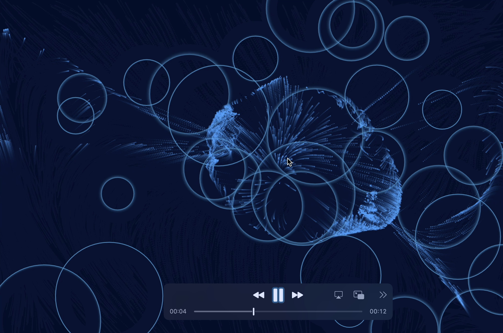
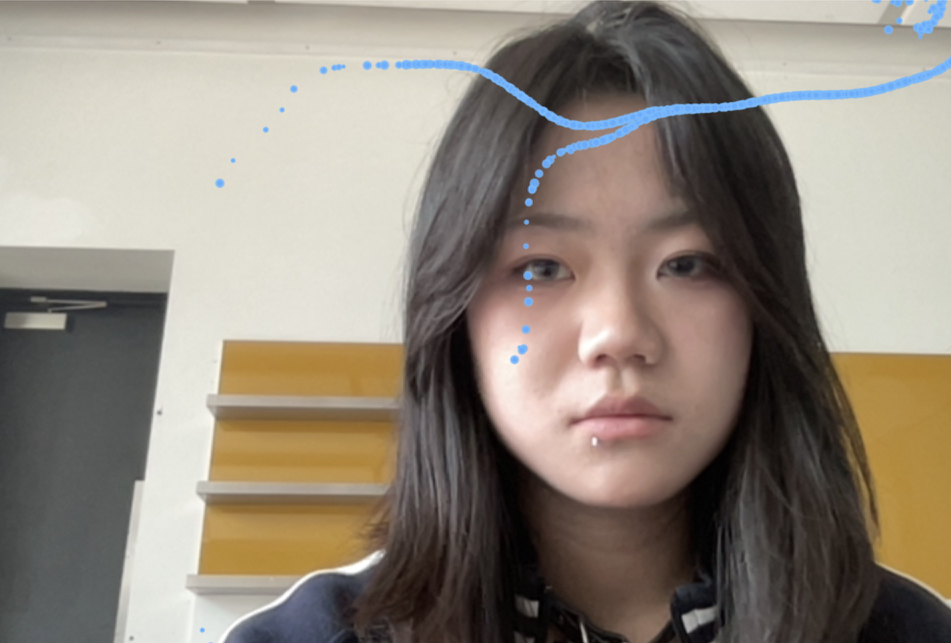
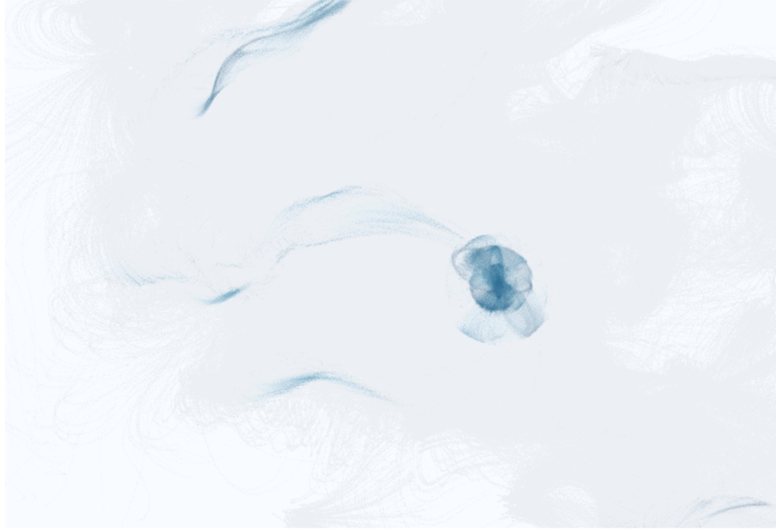
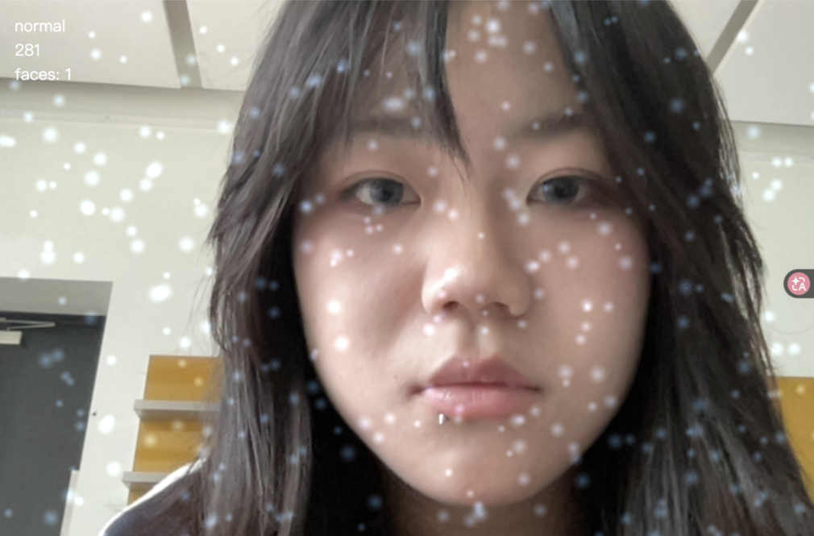

# Creative Computing Summer School 2026.University of the Arts London
This repository serves as a portfolio of my work created during the UAL Summer Study Abroad programme. Each project is built upon the technologies introduced throughout the course while being driven by my own artistic ideas, conceptual thinking, and creative exploration. Through creative coding, interaction, AI, and computational media, I aim to transform technical experiments into expressive works that reflect my evolving understanding of digital art and creative computing.

---

## Session 01 · Artistic Self Portrait

<p align="center">
  
</p>

---

## Project Overview

This project is a self-portrait created in p5.js using simple 2D shapes to recreate my appearance through code.

---

## Learning Objectives

 I learned how to use functions and basic drawing primitives to build a simple digital illustration.

---

## Reflection

In this session, I learned how to use p5.js as a creative tool to create visual artworks through code. I learned how basic functions such as `ellipse()`, `rect()`, `circle()`, `triangle()` and `arc()` can be combined to construct different visual elements and create a complete image.

Through this process, I realised that programming is not only about solving problems with logic, but can also become a way of expressing ideas and personal identity. By adjusting shapes, colours and positions, simple geometric elements can gradually become a meaningful visual representation.

I think this exercise is an important first step for me to understand creative coding, because it helped me connect technical skills with artistic thinking and encouraged me to explore more interactive and generative artworks in future projects.

It was my first day dealing with this; everything felt so unfamiliar, and the work was far too rough.

---
## Process

During the process of creating this self-portrait, I first divided the image into different parts, including the background, hair, face, facial features and clothing, and then built each part step by step using basic p5.js shapes.

Through continuous testing and modification, I gradually understood how coordinates, dimensions and colours work together in digital drawing. This process helped me become more familiar with using code to control visual elements.

## Tools

p5.js · Visual Studio Code · GitHub

---

## Code

```javascript
function setup() {
  createCanvas(400, 400);
  background(210, 225, 255);
  noStroke();

  fill(180, 200, 255, 80);
  ellipse(200, 200, 380, 420);

  fill(30, 30, 40);
  ellipse(200, 170, 170, 190);

```
## Session 02 · Generative Circular Village

---

## Project Overview

<p align="center">
  
</p>

This project explores generative art and computational creativity by creating a circular village system through code. The artwork uses algorithmic rules to generate houses, radial structures and spatial relationships, creating a digital environment that combines architecture, randomness and repetition.

---

## Learning Objectives

I learned how generative systems can be created through programming techniques, including arrays, conditional statements, loops and custom functions. I explored how rules written in code can produce unique visual outcomes instead of manually creating every detail.

---

## Reflection

In this session, I learned that creative coding can be used to create systems rather than only individual images. By defining rules and relationships between different elements, a program can generate complex visual structures that continue to evolve.

During this process, I realised that algorithms can become a creative partner. The artist does not control every single detail, but instead designs the logic behind the artwork and allows unexpected results to appear.

For this project, I wanted to explore how a simple circular structure could develop into a small digital settlement. I used coding and AI tools to experiment with different visual possibilities and refine the details of the village, making the final result more complete and artistic.

This session helped me understand the potential of generative art and gave me more confidence in combining programming techniques with my own design ideas.

---

## Process

I started by creating the basic circular structure of the village and used mathematical relationships to arrange houses around a central area. Instead of manually placing each building, I created rules that controlled their positions, directions and variations.

One of the main challenges was balancing randomness and visual control. Pure randomness often created messy results, while too much control made the artwork lose the feeling of generation. I adjusted parameters, colours and structures repeatedly to find a balance between algorithmic order and artistic expression.

I also experimented with AI tools during the refinement process to explore more detailed architectural possibilities and improve the overall visual quality. Through continuous iteration, I transformed a simple coded experiment into a more complete generative artwork.

---

## Tools

p5.js · Visual Studio Code · GitHub · AI Tools

---

## Code

```javascript
function setup() {
  createCanvas(900, 1200);
  noLoop();
}

function draw() {
  background("#f3ecd2");
  translate(width / 2, height * 0.52);

  stroke("#bcc8d8");
  for (let i = 0; i < 900; i++) {
    let a = random(TWO_PI), r1 = random(90, 220), r2 = random(420, 650);
    line(cos(a) * r1, sin(a) * r1, cos(a) * r2, sin(a) * r2);
  }

  fill("#f3ecd2");
  noStroke();
  circle(0, 0, 285);

  for (let i = 0; i < 24; i++) {
    let a = TWO_PI * i / 24, r = random(175, 265);
    push();
    translate(cos(a) * r, sin(a) * r);
    rotate(a + HALF_PI);
    house(random(0.7, 1.2));
    pop();
  }
}

function house(s) {
  scale(s);
  fill("#f3ecd2");
  stroke("#254f97");
  beginShape();
  vertex(-30, -30); vertex(10, -48); vertex(38, -15); vertex(28, 62); vertex(-32, 56);
  endShape(CLOSE);

  fill("#254f97");
  noStroke();
  beginShape();
  vertex(-38, -35); vertex(9, -62); vertex(48, -20); vertex(36, -8); vertex(8, -40);
  endShape(CLOSE);
}

```
## Session 03 · Blue Tide: Urban Ocean Generated by Data

---


## Project Overview

<p align="center">
  
</p>


This project explores generative art and computational creativity by transforming urban data into an abstract ocean simulation. The artwork uses London Underground data as creative material, reimagining the movement of people across the city as invisible waves and tides.

The core concept is that a city is not only a physical space, but also a living system shaped by millions of human movements. Every daily journey creates a hidden rhythm, similar to the movement of an ocean. In this project, subway stations become tidal sources, and human activity is translated into changing currents, colours and movement.

Instead of presenting data through traditional charts or maps, this project focuses on emotional and visual interpretation, turning numerical information into an immersive digital environment.

---

## Learning Objectives

Through this project, I explored how external data sources can become materials for creative coding and generative artwork.

I learned how to connect APIs with p5.js and use real-world information as input for an interactive visual system. I experimented with transforming data values into artistic parameters, such as movement intensity, colour changes and environmental behaviour.

This session helped me understand that data is not only a source of information, but also a creative medium that can be translated into different artistic forms.

---

## Reflection

During this project, I explored the relationship between cities, human behaviour and computational systems.

The idea behind this artwork comes from the observation that urban life has its own rhythm. Millions of people move through London every day, entering and leaving stations, creating invisible patterns that are difficult to perceive. By transforming this movement into an ocean-like system, I wanted to reveal the hidden connection between individual lives and the larger city environment.

The colour blue represents both the depth of the ocean and the continuous flow of urban life. The changing currents represent how human activity constantly shapes and reshapes the city.

Through this process, I realised that creative coding provides a new way of seeing the world. Data does not have to remain as numbers or statistics; through artistic interpretation, it can become movement, atmosphere and emotion.

This project also changed my understanding of generative art. The artist does not simply create an image, but designs a system where unexpected visual results can emerge. Any type of data has the potential to become an artwork when combined with imagination and creative thinking.

---

## Process

I started by researching possible urban datasets and chose London Underground data as the foundation of the project. The original idea was to visualise passenger flow, but instead of creating a traditional data visualisation, I decided to transform the information into an abstract ocean system.

I created a particle-based environment where stations act as invisible tidal sources. Different data values influence the strength of these forces, affecting the movement and density of particles.

One of the main challenges was finding a balance between data accuracy and artistic expression. A direct representation of data often becomes a simple visualisation, while too much abstraction can make the connection with the data unclear. I experimented with different relationships between data and visual elements to create a system that was both meaningful and visually engaging.

Another challenge was connecting external data with a generative system. Through working with APIs and p5.js, I learned how real-world information can continuously influence a digital artwork.

---

## Tools

p5.js · Visual Studio Code · TfL API · GitHub · AI Tools

---

## Code

```javascript
function draw(){

  background(3,15,45,35);

  for(let p of particles){

    let forceX = 0;
    let forceY = 0;

    for(let s of stations){

      let dx = s.x - p.x;
      let dy = s.y - p.y;
      let d = sqrt(dx*dx + dy*dy);

      if(d < 350){
        let strength = map(s.flow,0,200,0,0.04);
        forceX += dx * strength / d;
        forceY += dy * strength / d;
      }
    }

    p.x += forceX;
    p.y += forceY;

    circle(p.x,p.y,2);
  }
}

```

## Session 04 · Interactive Particle Systems

---

## Project Overview

<p align="center">
  
</p>


<p align="center">
  
</p>


This session explores interactive digital experiences through two particle-based artworks created with p5.js. Both projects investigate the relationship between computational systems and human interaction, exploring how particles can respond, transform and create dynamic visual experiences through different input methods.

The first project uses webcam and hand interaction to create a responsive particle field, while the second project uses mouse movement as an external force that disturbs and reshapes the particle system.

---

## Learning Objectives

I learned how to create interactive graphics using user input, including mouse interaction, webcam data and interface elements in p5.js. I explored how digital artworks can move beyond static images and become responsive systems that change according to human behaviour.

---

## Reflection

In this session, I learned that interaction can change the relationship between the viewer and the artwork. Instead of simply observing a finished image, users become part of the system and influence how the artwork develops.

Through creating particle-based interactions, I realised that code can be used to simulate behaviours and relationships rather than only produce fixed visual results. The particles are controlled by mathematical rules, but unexpected movements and patterns can emerge through interaction.

For the hand-tracking particle system, I explored how human movement could become an invisible force that reorganises digital particles. For the mouse interaction project, I experimented with disturbance and environmental influence, treating the cursor as an external element that affects the balance of the system.

These experiments helped me understand interactive art as a process of communication between humans, algorithms and digital environments.

---

## Process

I started by building a basic particle system and defining the rules that controlled particle movement, attraction, repulsion and flow. After creating the foundation, I introduced different interaction methods to explore how the system could respond to external input.

For the webcam-based project, the main challenge was connecting real-time human movement with particle behaviour. I experimented with hand position, movement speed and interaction distance to make the particles react naturally.

For the mouse interaction project, the challenge was balancing control and randomness. At first, the particle movement felt too mechanical, so I adjusted forces, noise fields and damping values to create a more organic feeling.

Through continuous testing and refinement, I gradually moved from creating simple particle effects toward designing a system with its own behaviour and visual language.

---

## Tools

p5.js · ml5.js · Face/Hand Tracking · Webcam Input · Visual Studio Code · GitHub

---

## Code

```
class Particle {

  constructor(x, y){
    this.pos = createVector(x, y);
    this.vel = p5.Vector.random2D();
    this.size = random(2,6);
  }


  update(){

    let force = createVector(
      mouseX - this.pos.x,
      mouseY - this.pos.y
    );

    force.mult(0.001);

    this.vel.add(force);
    this.pos.add(this.vel);

  }


  display(){

    noStroke();
    fill(120,180,255,150);

    circle(
      this.pos.x,
      this.pos.y,
      this.size
    );

  }

}
```
# Session 05 · Artistic Face Recognition System

---

## Project Overview
<p align="center">
  
</p>

This project explores the relationship between human perception and machine vision through an interactive face recognition artwork.

Using p5.js and ml5.js FaceMesh, the system detects human facial information through a webcam and transforms the captured data into an abstract visual experience. Instead of simply recognising a face, the project questions how machines interpret human presence through limited digital information.

The artwork explores the idea that artificial intelligence can analyse human features, but understanding human identity and emotion remains a complex challenge.

---

## Learning Objectives

In this session, I learned how to use machine learning tools in creative coding projects, especially how webcam data and face detection models can be integrated into interactive artworks.

I explored how real-time data can be transformed into visual responses and learned how AI-based systems can become a creative medium rather than only a technical tool.

---

## Reflection

Through this project, I realised that AI perception is based on patterns and data rather than true understanding. A machine can recognise facial structures, distances and movements, but it cannot fully understand the meaning behind human expressions.

The development process also changed my understanding of creative coding. Technical problems such as unstable tracking and incorrect detection became part of the creative exploration, because they revealed the limitations and uncertainty of machine perception.

This project encouraged me to think about the relationship between humans and AI, which later influenced my interest in creating more complex AI-based interactive artworks.

---

## Process

I started by connecting the webcam input with ml5.js FaceMesh to detect facial landmarks in real time. The detected data was then converted into visual changes, allowing the system to respond to the user's presence.

During development, I encountered several technical challenges. The face detection was sometimes unstable, especially when the user moved too quickly or changed distance from the camera. The tracking data could also become inaccurate, causing unexpected visual behaviour.

To solve these problems, I adjusted detection thresholds, improved the interaction logic and created different states based on face distance. Through continuous testing, I learned how machine learning models require careful adjustment when used in artistic systems.

---

## Tools

p5.js · ml5.js FaceMesh · Webcam Input · Visual Studio Code · GitHub

---

## Core Code

```javascript
let video;
let detector;
let faces = [];

function setup(){

  createCanvas(windowWidth,windowHeight);

  video=createCapture(VIDEO);
  video.size(640,480);
  video.hide();

  detector = ml5.faceMesh(video, modelReady);

}


function modelReady(){

  detector.detectStart(video, gotFaces);

}


function gotFaces(results){

  faces = results;

}


function draw(){

  background(5,7,10);

  if(faces.length > 0){

    let face = faces[0];

    let distance = face.box.width;

    if(distance < 180){

      fill(255);
      text("TOO CLOSE",50,50);

    }

    else{

      fill(168,230,255);
      text("RECOGNIZED",50,50);

    }

  }

}
