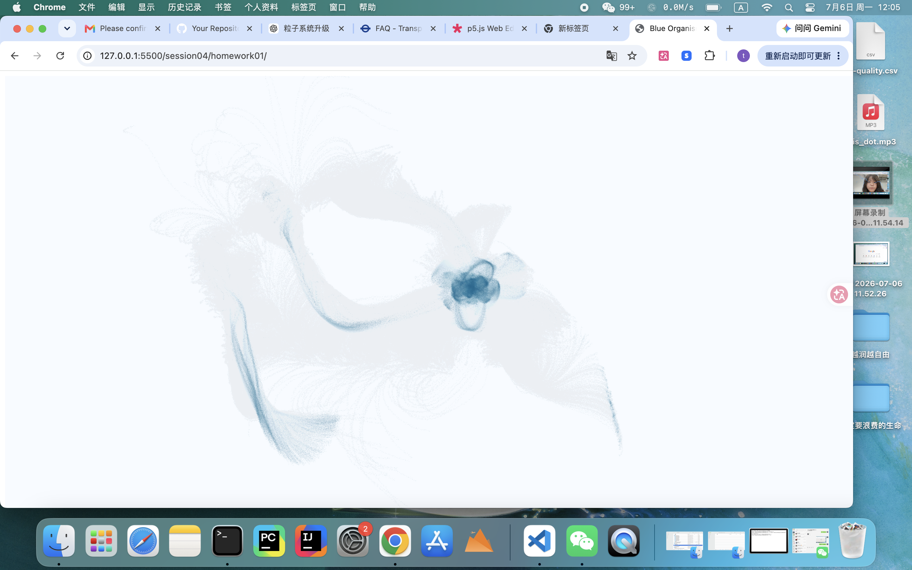

# homework01

## Concept 

This project explores the tension between computational systems and perceived life.

It simulates a field of particles driven by deterministic rules. Although every element in the system is numerically defined—position, velocity, noise, and attraction—the interaction of these simple rules over time produces behaviors that feel organic, unstable, and self-organizing.

The mouse is not designed as a controller, but as a source of light and environmental disturbance. It moves through the system like an external force, compressing, pulling, and disrupting local structures. The system constantly shifts between order and disruption, forming temporary clusters that appear briefly alive before dissolving again.

The core idea of this work is the collision between computational neutrality and biological perception: how strict digital rules can generate fragile, fluid, life-like structures that are not explicitly designed, but emerge through interaction.

---
## Development Process 

During development, one of the main challenges was balancing visual complexity with performance. Early versions used global pairwise interaction between particles, which caused severe performance issues as the system scaled.

To solve this, the system was restructured using spatial partitioning (grid-based neighbor search), allowing particles to only interact with nearby neighbors. This preserved local interaction behavior while maintaining real-time performance.

Another challenge was controlling system stability. Strong attraction forces caused particles to collapse into static clusters, while excessive noise produced chaotic motion with no structure. The final system was achieved through careful balancing of flow field motion, local attraction, damping, and mouse interaction, resulting in a state of continuous but unstable organization.

Through iteration, the project shifted from a simple particle simulation into a system that behaves as if it is temporarily alive.

## Getting Started

Open `index.html` in your web browser and start editing `sketch.js`.

## Running Locally

For projects with media files, use a local server:

```bash
# Using Python
python -m http.server 8000

# Using Node.js
npx http-server

# Using VS Code Live Server extension
# Right-click index.html -> "Open with Live Server"
```

## Resources

- [p5.js 2.0](https://beta.p5js.org/)
- [p5.js Reference](https://p5js.org/reference/)
## Preview

